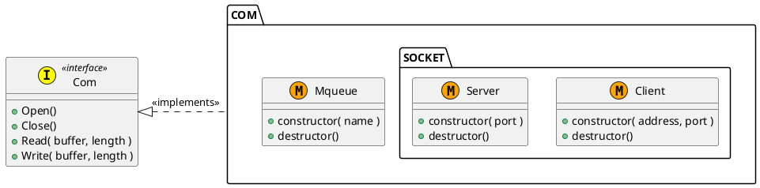

# Com

Dependencies: `lrt`  
Includes: `com.h` `mqueue_com.h` `socket_com_client.h` `socket_com_server.h`


## How to Build

```sh
$ sudo ./mk.sh
#snip
$ ls /home/lib
libcom.a
$ ls /home/include
com.h ...
```


## Design




## Usage

```c
#include <stdio.h>
#include <pthread.h>

#include <mqueue_com.h>
#include <com.h>

static const char * const NAME = "/msgqueue";

static void * WriteThread( void *pArg )
{
    (void)pArg;
    Com *pCom = __new__MqueueCom( NAME );
    pCom->Open( pCom );

    char buf = 1;
    pCom->Write( pCom, &buf, 1 );

    pCom->Close( pCom );
    pCom = __del__MqueueCom( pCom );
    pthread_exit( NULL );
}

int main( void )
{
    pthread_t thread;
    pthread_create( &thread, NULL, WriteThread, NULL );
    pthread_detach( thread );

    Com *pCom = __new__MqueueCom( NAME );
    pCom->Open( pCom );

    char buf = 0;
    pCom->Read( pCom, &buf, 1 );
    if ( buf > 0 ) {
        printf( "Communication success.\n" );
    }

    pCom->Close( pCom );
    pCom = __del__MqueueCom( pCom );
    return 0;
}
```
